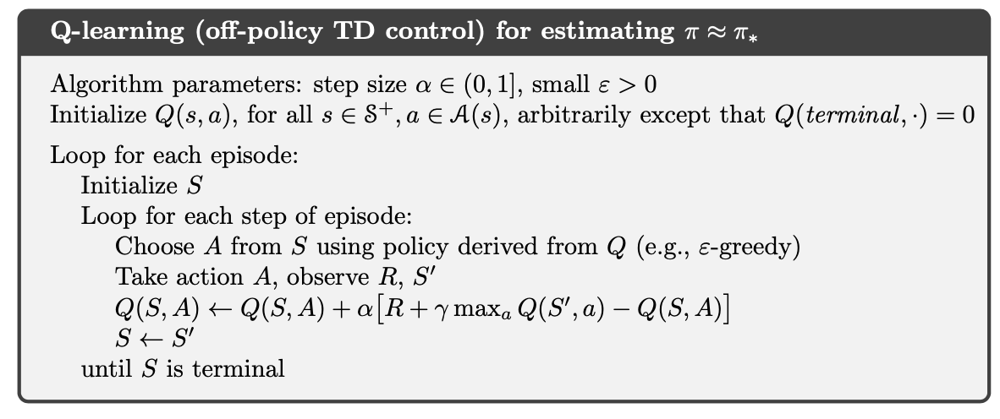
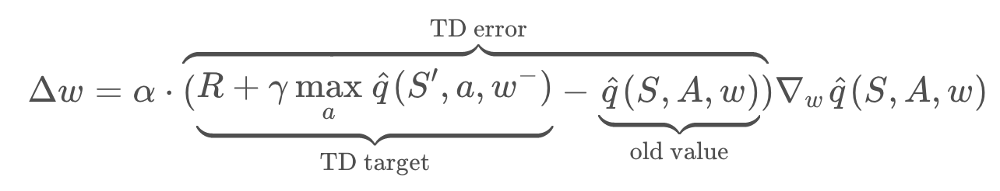
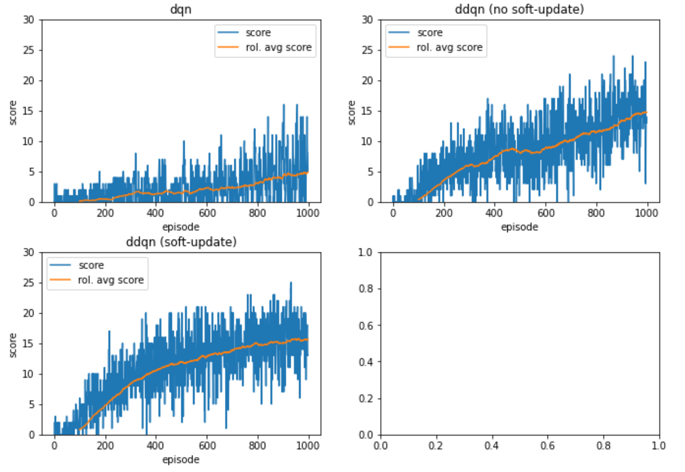

# Project 1: Collecting Bananas 

## Problem

For this project we had to train an agent to collect yellow bananas in [Unity ML-Agent Toolkit](https://github.com/Unity-Technologies/ml-agents) environment. The template code to set up a local training environment can be found [here]((https://github.com/udacity/deep-reinforcement-learning/tree/master/p1_navigation)). 

The problem description provided by Udacity is as follows: 

```
A reward of +1 is provided for collecting a yellow banana, and a  reward of -1 is provided for collecting a blue banana.  Thus, the goal  of your agent is to collect as many yellow bananas as possible while  avoiding blue bananas.

The state space has 37 dimensions and contains the agent's velocity,  along with ray-based perception of objects around agent's forward  direction.  Given this information, the agent has to learn how to best  select actions.  Four discrete actions are available, corresponding to:

- 0 - move forward.
- 1 - move backward.
- 2 - turn left.
- 3 - turn right.

The task is episodic, and in order to solve the environment, your  agent must get an average score of +13 over 100 consecutive episodes. 
```

## Learning Algorithm

To solve the learning task I used the [Deep Q-Network (DQN)](https://storage.googleapis.com/deepmind-media/dqn/DQNNaturePaper.pdf) algorithm. DQN extends the well known Q-learning algorithm to infinite (or practically infinite) state spaces and is therefore applicable to the banana collection task.

Additionally many extensions were proposed to the DQN algorithm to boost the learning performance in terms of speed, stability of learning and quality of the final policy. Some of this extensions, such as [Double DQN (DDQN)](https://arxiv.org/abs/1509.06461), ([prioritised](https://arxiv.org/abs/1511.05952)) Experience Replay, Fixed Q-Targets, [Dueling DQN](https://arxiv.org/abs/1511.06581), were presented in the course. I implemented some of these extensions and am going to present benchmarks in a the next section. This section explains the algorithms I used in my final solution.

### Q-Learning

The Q-Learning algorithm is a method to solve problems formulated as finite Markov Decision Processes (MDP). Let an MDP be defined as $(S, A, R, p)$. Then solving an MDP Problem means to find a policy $\pi^*: S \times A \rightarrow [0, 1]$  that maximises the expected return $G_t= R_t + R_{t+1} + ...$. 

In Q-learning an agent follows a policy $\pi$ to generate experiences $(s, a, r, s') \in (S, A, R, S)$  from the training environment. These experiences are used to gradually improve our estimates of the *state-action values* for each state-action tuple $(s,a) \in (S, A)$. Let $Q: S, A \rightarrow \mathbb{R}$ be the table of estimates for the state-action values. Then the Q-Learning algorithm defines the following update rule for the Q-values:
$$
Q(s, a) \leftarrow Q(s, a) + \alpha \left[r + \gamma \max_{a'} Q(s', a') - Q(s, a)\right]
$$
where $\alpha \in [0, 1]$ and $\gamma \in [0, 1]$ are hyperparameters.

In order for $Q$ to converge to the real state-action values $Q^*$, policy $\pi$ must guarantee to visit each state $s \in S$ and choose each action $a \in A$ infinitely often [Ch. 6.5 Reinforcement Learning by Sutton and Barto]. This is accomplished by e.g. the $\epsilon$-greedy policy, where we choose action $\text{argmax}_{a'} Q(s, a')$ with probability $1-\epsilon$ and a random action with probability $\epsilon$, with $\epsilon \in (0, 1)$.

In short the algorithm looks as follows [Ch. 6.5 Reinforcement Learning by Sutton and Barto]




### Deep Q-Network (DQN)

The [DQN]((https://storage.googleapis.com/deepmind-media/dqn/DQNNaturePaper.pdf)) algorithm extends Q-Learning to problems with an infinite (or practically infinite) number of states. Instead of saving the state-action values in a table, it uses a *Deep Neural Network (DNN)* as an associative store. The update rule from above stays the same, but $Q$ is now a DNN. As such we have to use cannot simply replace the current Q-value to an updated value. Instead we have to modify the weights of the DNN in a way that the DNN produces values that resemble the updated updated or target Q-values. This is done by using well known algorithms to train DNNs, such as Forward- and Backpropagation, Stochastic Gradient Descend etc. 

#### Fixed Target Network

The RL course proposes to modify the Q-Learning update rule by using a fixed Target-DNN instead of the same DNN we are going to change. That is the update rule is changed to  



Where $\hat{q}(., ., w^-)$ is the fixed target DNN and $\hat{q}(., ., w)$ is the DNN we are going to update. From time to time the fixed weights $w^-$ are set to the current weights $w$ in order to set the TD target to more current state-action value estimates. This change in the update rule is said to improve and stabilize learning.

#### Experience Replay

A benefit of an off-policy method like Q-learning is that we can save experience tuples and reuse them  multiple times for training. One reason to store the experiences could be that generating experiences is expensive and we want to reduce the cost of our experimental setup, e.g if we try to teach an agent to fly a real helicopter. Another reason, especially relevant for DQN, is that we want to break correlations between subsequent experience tuples by sampling random experiences from the experience store and learning from those instead of the experiences that occur when navigating the environment.

#### Soft Update of the target DNN

Soft Update wasn't explained in the Udacity RL course, but was used in a workbook exercise. The idea is *not* to update the target Q-network in a single step, but to average the weights between the target and trained Q-Network, i.e:
$$
w^- \leftarrow \tau w^- + (1-\tau) w
$$
This tweak turned out to have a positive effect on training performance. From my point of view the same effect should be achievable by reducing the learning rate and updating the weights more often, but this wasn't the case in my tests. On the other hand Soft Update may be beneficial for the DDQN extension, as it relies on two distinct Q-networks and Soft Update makes sure that the two DNNs are more distinct.

#### Double DQN (DDQN)

Another tweak proposed in the course is DDQN. The idea is to use one Q-networks to choose the best action and another Q-network to evaluate the action, i.e. the TD target is changed from $R + \gamma \max_a \hat{q}(S', a, w^-)$ to 
$$
R + \gamma \hat{q}(S', \text{argmax}_a \hat{q}(S', a, w), w^-)
$$
This change is said to have a positive effect on learning.

### Model Architechture

The DQN algorithm requires a *deep neural network (DNN)* to work as an associative storage to *save* the state-action values. I chose to use a DNN with the following architecture

- 1 input layer $\in \mathbb{R}^{37}$
- 2 fully connected hidden layers $\in \mathbb{R}^{64}$ 
- 1 output layer with $\in \mathbb{R}^4$ 

The summary output looks as follows.

```
----------------------------------------------------------------
        Layer (type)               Output Shape         Param #
================================================================
            Linear-1                   [-1, 64]           2,432
            Linear-2                   [-1, 64]           4,160
            Linear-3                    [-1, 4]             260
================================================================
Total params: 6,852
Trainable params: 6,852
Non-trainable params: 0
----------------------------------------------------------------
Input size (MB): 0.00
Forward/backward pass size (MB): 0.00
Params size (MB): 0.03
Estimated Total Size (MB): 0.03
----------------------------------------------------------------
```

## Results

I implemented 3 versions of the DQN algorithm

- DQN (with experience replay)
- DDQN (with experience replay)
- DDQN with soft-update (and experience replay)

Here are the training results over 1000 episodes. The blue line represents each episode. The orange line ist the mean over the last 100 episodes.



We can draw multiple findings

- A (vanilla) DQN agent manages to score only around 4 Bananas per episode.
- The average scores of the two DDQN implementations are both around 15 bananas per episode, but DDQN with soft-update seems to train more stable.
- The DQN tweaks, such as DDQN and Soft Update, have a significant impact on the training performance.

- During development I have seen a significant impact of the hyperparameter values (e.g. $\epsilon$, $\epsilon$-decay, batch size, DNN architecture, etc) onto training performance.

  

## Ideas for future work

I can see multiple ways how to improve the performance further

- We have seen, that tweaks to the DQN algorithm, such as DDQN and Soft Update have a significant impact onto training performance. The Udacity RL course presented multiple other extensions, such as Prioritized Experience Replay, Dueling DQN and Rainbow. A sensible next step is to implement and test these extensions.
- I have seen during implementation that the values of hyperparameters have a significant effect on training performance. I could perform a more thorough exploration of this effects, e.g. by performing a grid search on some of the hyperparameters.

